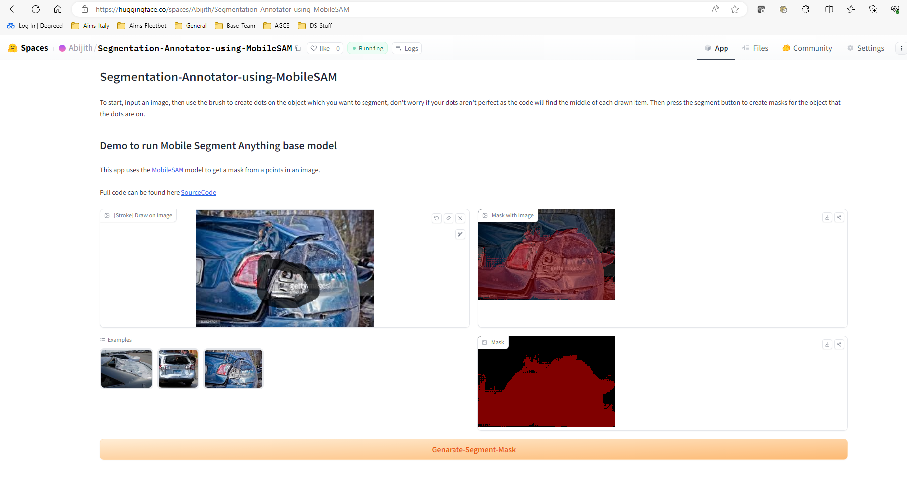

# Segmentation-Annotator-using-MobileSAM
App used to create segment labels bu using MobileSAM model.

## SAM
Use this repository to know more about [SAM](https://segment-anything.com/)

## PerSAM
Used these repositories to know more about 
- Personalization of sam, [PerSAM](https://github.com/ZrrSkywalker/Personalize-SAM)
- Mobile version of sam, [MobileSAM](https://github.com/ChaoningZhang/MobileSAM)

## Model
Please download **MobileSAM** model from [here](https://github.com/ChaoningZhang/MobileSAM/tree/master/weights) and paste in **weight** folder.

## Demo
Deployed in HuggingFaceSpace [ClickHere](Abijith/Segmentation-Annotator-using-MobileSAM)
 
